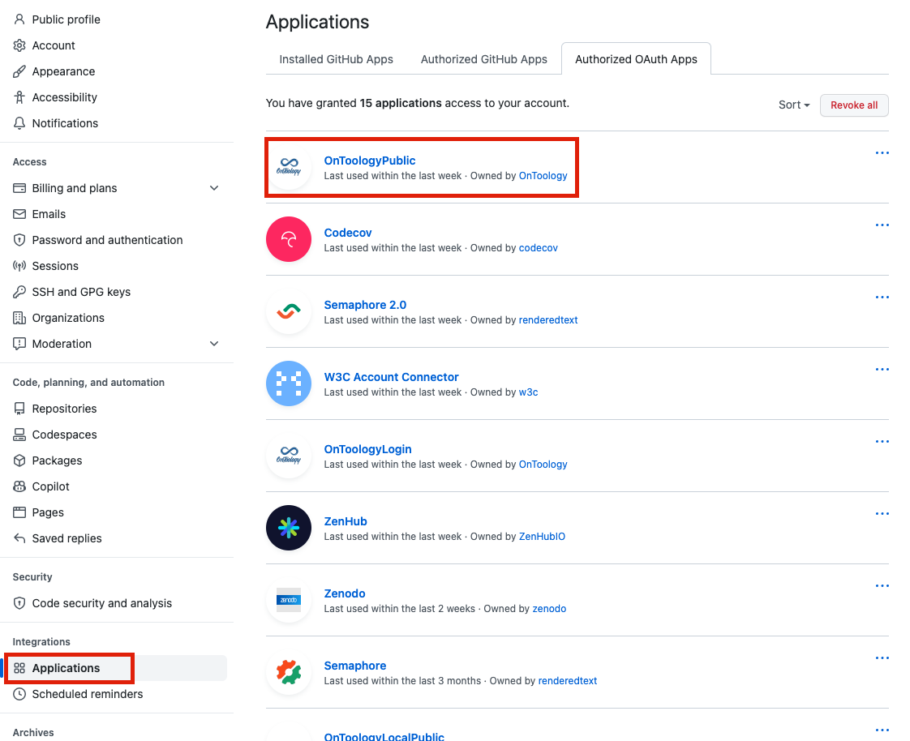

# 


[](https://doi.org/10.5281/zenodo.1317786)
[](https://www.codacy.com/gh/OnToology/OnToology/dashboard?utm_source=github.com&amp;utm_medium=referral&amp;utm_content=OnToology/OnToology&amp;utm_campaign=Badge_Grade)
[](https://twitter.com/OnToology) [](https://opensource.org/licenses/Apache-2.0)


A system for collaborative ontology development process. Given a repository with an owl file, **OnToology** will survey it and produce diagrams, a complete documentation and validation based on common pitfalls. It also offers seamless publication of user ontologies with w3id using GitHub pages.

You can find a live version of OnToology online: [http://ontoology.linkeddata.es](http://ontoology.linkeddata.es).

Team: Ahmad Alobaid, Daniel Garijo, Maria Poveda, Idafen Santa, Alba Fernandez Izquierdo, Oscar Corcho

License:  [Apache License v2](https://opensource.org/licenses/Apache-2.0)

If you want to cite Ontoology in a scientific paper or technical report, you can use the following [Bibtex citation](/media/references/ontoology.bib) or directly this text: [Alobaid A, Garijo D, Poveda-Villalón M, Santana-Pérez I, Fernández-Izquierdo A, Corcho O (2019) Automating ontology engineering support activities with OnToology. Journal of Web Semantics 57:100472, https://doi.org/10.1016/j.websem.2018.09.003](https://doi.org/10.1016/j.websem.2018.09.003)

# Funding

The development of OnToology has been supported by the Spanish national project Datos 4.0 (TIN2016-78011-C4-4-R)

# Tools

Here is a list of tools being used by OnToology.

* [owl2jsonld](https://github.com/stain/owl2jsonld) ( [zenodo](http://dx.doi.org/10.5281/zenodo.10565) )
* [Widoco](https://github.com/dgarijo/Widoco) ( [zenodo](https://zenodo.org/badge/latestdoi/11427075) )
* [OOPS!](http://oops.linkeddata.es)
* [AR2DTool](https://github.com/idafensp/ar2dtool)
* [oops-report](https://github.com/OnToology/oops-report)
* [Themis](https://github.com/oeg-upm/Themis)

# Documentation for users

If you are an ontology engineer willing to use OnToology, you can check our [step by step documentation](http://ontoology.linkeddata.es/tutorial). You can also check our list of [Frequently Asked Questions](http://ontoology.linkeddata.es/faqs)

# Documentation for developers

We provide some documentation for developers who want to contribute to the development OnToology or for those who are interested in deploying OnToology locally or in their servers. Feel free to contact us if you are interested in contributing to the project.

## Test workflow

There are two kinds of tests:

1. Using mock. These kinds of tests use a list of stored requests expected from GitHub APIs. These are fast and do not need GitHub keys or setup.
2. Using real GitHub repos. These kinds of tests uses GitHub APIs. These tests can take some time and need special keys to access relevant test repos. For this reason, these are not available for the public. However, they are executed automatically after each *merge* to the `main` branch.


## Environment Variables

```bash
#!/bin/sh
export github_password=""
export github_email=""
export client_id_login=""
export client_id_public=""
export client_id_private=""
export client_secret_login=""
export client_secret_public=""
export client_secret_private=""
export test_user_token=""
export test_user_email=""
export github_username=""
```


# Deploy

1. Clone the repo.
2. Set up the variables in `OnToology/localwsgi.py` (see above for the details).
3. Create virtual env (optional).
4. Install dependencies using pip (`pip install -r requirements`).
5. Run the [stiqueue](https://github.com/ahmad88me/stiqueue) server
(with the ip and port).
6. Run `OnToology/sqclient.py`.

# Debugging Guide
## Debugging Live Version
Sometimes things happens and the processes or the APIs fail. Here are the common ones and how to resolve them.
1. *Access permissions* on the server. OnToology generates the resources, which are automatically has different permissions 
(probably www-data) rather than the user itself. So, make sure that the apache user has the permission to do so.
2. *GitHub permissions*. When users add their repo to OnToology, the proper permissions will be added. There are two: 
   1. *OnToology access*. 
   2. *OnToologyUser as a collaborator*. In this case, the last thing that will be shown in the user log will be `new htaccess:` (if the repo didn't has any ontology published before. If the repo has published an ontology before, you will see that OnToology tried several times to publish, but failed). 

